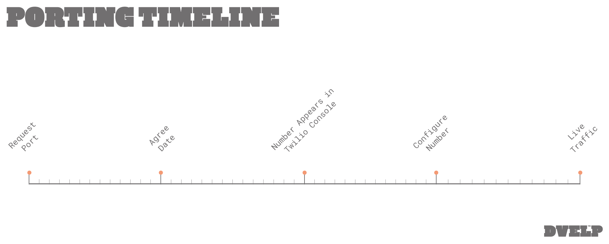

# Porting Numbers to Twilio

Number porting is a key part of the process to migrating your existing call or
messaging operations to Twilio.

There are a number of different ways to get voice and SMS traffic into Twilio,
but for any enterprise deployment, porting your numbers to the platform is the recommended approach.

Porting numbers in is relatively easy, but be aware of any local or national
restrictions that could add complexity.

The following steps outline our recommended process for porting numbers to
Twilio:

## Step-by-Step Guide

### Request Port
[Submit a porting request](https://www.twilio.com/user/account/phone-numbers/porting-requests) through the Twilio console or directly to your Twilio account manager. This first step consists of 6 sub-steps, which can be found [here](https://support.twilio.com/hc/en-us/articles/223179348-Porting-a-Phone-Number-to-Twilio).

### Agree a Date
Once your porting request has been approved, you will want to agree a date for the porting to complete with your Twilio account manager.

It's advisable to choose a date that fits in with any key business requirements
and at a time when your team will be available to support and monitor.

The first two steps are lead time items and can take many weeks depending on
your existing setup. It's advisable to get these completed and then plan your
tactics for the port.

### Plan
Make sure you have a plan in place for the days pre, during and post the port.
Circulate the plan so your team and wider business have visibility. The plan
should cover the following points:

- **Risk:** Porting numbers can be low risk if you plan correctly. Try to identify
  the path of least resistance for the initial phase of the port. If you are
  migrating live traffic, it's recommended to use a simple TwiML Bin to forward
  traffic on to an existing endpoint or application without adding new
  functionality at this stage.

- **Automation:** To port a number successfully, you will need to configure it in
  Twilio. This process is quite straightforward, but in the heat of the battle
  you should look to automate it so you can repeat it reliably.

- **Monitoring:** Active and passive reporting is recommended. Make sure you have
  your team on hand to actively monitor logs at when the porting completes to
  help identify any critical issues.

- **Rollback:** Make sure you have a pre-agreed rollback plan in the event any
  critical issues arise that cannot be easily resolved. In the case of number
  porting, this may be a simple TwiML Bin with an outbound dial or perhaps a
  degraded service message.

### Test
Once you have identified the path of least resistance and written any
scripts to automate the number provisioning process, you should do a dry-run.

The easiest way to do a try run is purchase a new number on Twilio (with the
same capabilities as the number you are porting). You can use this number as a
guinea pig for your script and can make phone calls or send messages to ensure
the customer experience is what you would expect.

### Configure
Before the porting completes and your numbers receive live traffic through Twilio, they will appear in the Twilio console. This will typically happen 24-48hrs
before the agreed porting date and is your time to configure them with the
relevant voice and messaging settings.

- Run your script (or manually) to configure the numbers
- Check in the console that the numbers are set up correctly

### Monitor
The day of the port has arrived and you will soon start to see production
traffic flowing into your Twilio account. To help it run smoothly, we recommend:

- Active monitoring of the Twilio console, keeping a close eye on the call and
  messaging logs for any failures for at least 30 minutes
- Test calls or messages to verify customer experience
- Passive monitoring after the first 30 minutes of active monitoring, making
  sure any Twilio console, or application errors are being reported correctly

### Extend
Once live traffic is flowing through Twilio and your happy everything is stable and working as expected, it's time to incrementally adding functionality.

